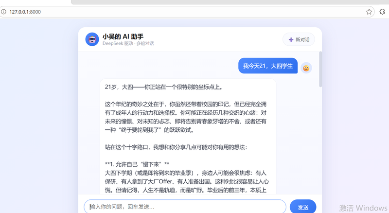

# 小吴的 AI 小助手 🤖

一个基于 **DeepSeek 大模型 API** 的网页版 AI 聊天助手,支持**多轮对话记忆**和**多会话**。

- 前端页面输入问题 → 后端调用 DeepSeek API → 返回回答显示在页面
- 每个会话独立,互不干扰;刷新页面后聊天记录仍在
- API Key 存于本地 `config.py`,不随代码提交,安全不泄露

## ✨ 功能

- 🗨️ **多轮对话** — 记得你前面说过的话,能接着聊
- 📚 **多会话** — 点「新对话」开启全新话题,各聊各的
- 💾 **历史恢复** — 刷新页面,之前的对话自动加载回来
- 🎨 **清爽界面** — 渐变背景 + 气泡式对话 + 头像区分

## 📸 效果预览



## 🛠️ 技术栈

- **Python** + **FastAPI**(后端接口)
- **DeepSeek API**(大模型对话)
- **HTML / JavaScript**(前端页面)
- Pydantic 数据校验

## 📁 项目结构

```
ai-chat-assistant/
├── main.py              # 程序入口,定义接口(最薄的一层)
├── deepseek_client.py   # 负责调用 DeepSeek API 的函数
├── index.html           # 聊天网页(前端)
├── requirements.txt     # 依赖库清单
└── config.py            # 🔒 存放 API Key(本地才有,不上传)
```

## 🚀 本地运行

1. 安装依赖:

   ```bash
   pip install -r requirements.txt
   ```

2. 在项目目录新建 `config.py`,填入你的 DeepSeek API Key:

   ```python
   API_KEY = "你的 key"
   ```

3. 启动服务:

   ```bash
   python main.py
   ```

4. 浏览器打开 <http://127.0.0.1:8000> 开始聊天;接口文档见 <http://127.0.0.1:8000/docs>

## 🔌 接口说明

| 接口 | 方法 | 作用 |
|------|------|------|
| `/` | GET | 返回聊天页面 |
| `/chat` | POST | 发送消息,返回 AI 回答(需带 `message` 和 `session_id`) |
| `/history` | GET | 获取某个会话的历史记录 |

## ⚠️ 安全提醒

`config.py` 里的 API Key 是付费的,**绝对不要上传到 GitHub**。本项目不上传该文件,Key 只在本地使用。

---
由 DeepSeek API 驱动 · 用 FastAPI 独立开发
